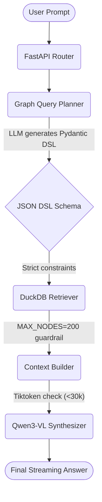
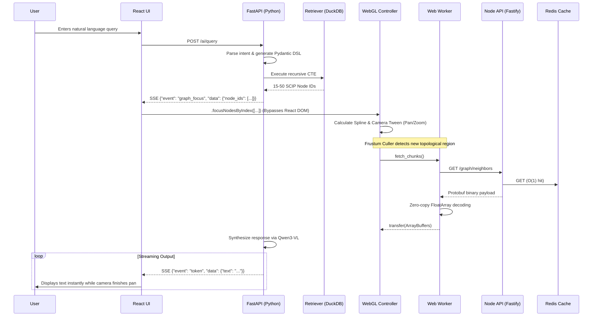

# VisionFlow Architecture: The "Golden Loop"

This document outlines the real-time UX cycle (The Golden Loop) that bridges the AI Reasoning backend, the Data delivery layer, and the GPU rendering frontend.

## 1. The Multi-modal AI Reasoning Pipeline (Phase 5)

The AI Reasoning layer validates queries to prevent hallucination and uses Token Budgeting to prevent context collapse.

## 2. The Golden Loop: End-to-End Real-Time Execution

This sequence details the real-time interaction where the frontend achieves instant responsiveness by orchestrating AI reasoning and WebGL rendering concurrently over Server-Sent Events (SSE).

### Critical Interactions

1. **The Client Handoff**: The React UI acts strictly as a signal relay. When `graph_focus` is received, it patches the nodes straight into `WebGLController`, avoiding any DOM reconciliation overhead for the visualization.
2. **The GPU Tween**: The camera pans seamlessly to the topological destination. Concurrently, the Web Worker dynamically streams any missing nodes from the Node.js API over Protobuf in the background.
3. **The Synthesis Overlay**: By the time the camera rests on the active nodes and MSDF text labels resolve crisply on the screen, the LLM synthesis is already streaming the answer to the user character-by-character.
